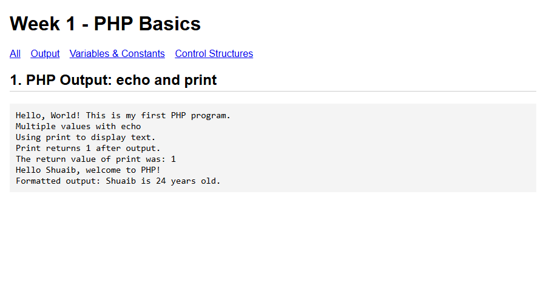
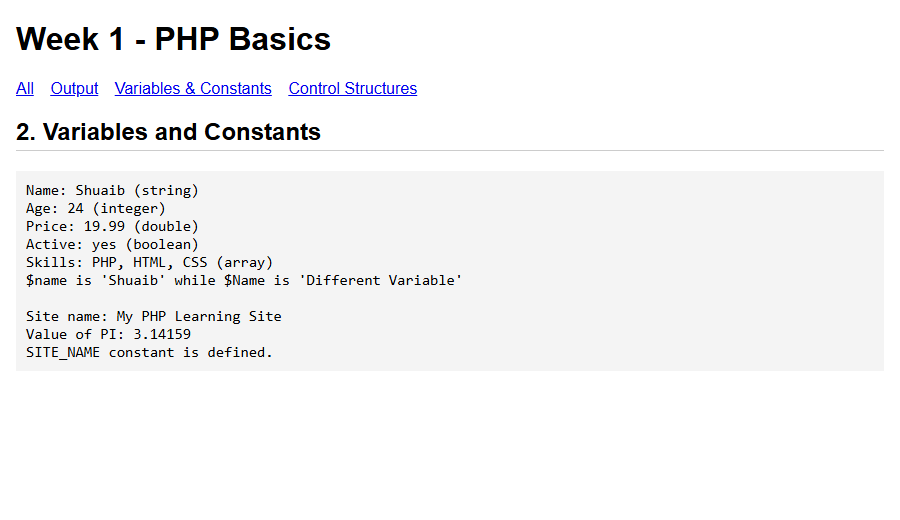
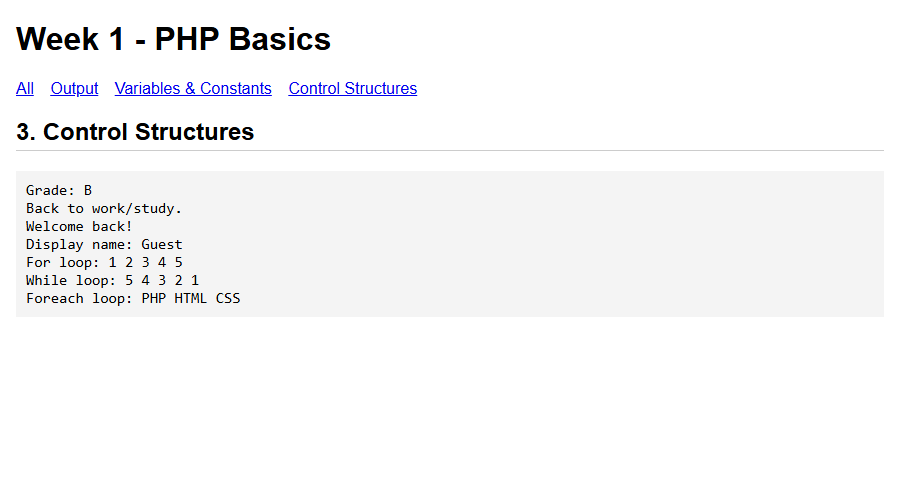

# Week 1: PHP basics

Week 1 practice covers three topics: output, variables and constants, and control structures. All the code is in `index.php`.

## How to run

Start Apache in XAMPP and open `http://localhost/php/week1/`. The links at the top show one topic at a time, or you can add `?topic=output`, `?topic=variables` or `?topic=control` to the URL.

## Topics

### 1. Output with echo and print

`echo` can print several values at once and returns nothing. `print` takes one value and returns 1. `printf` prints formatted text.

### 2. Variables and constants

Variables start with `$`, don't need a declared type, and are case sensitive. Constants are made with `define()` and can't be changed after that.

### 3. Control structures

Covers if/elseif/else, switch, the ternary and `??` operators, and the for, while and foreach loops.

## Author

Shuaib Osman Daud Enow, IT student (Computer Application)
