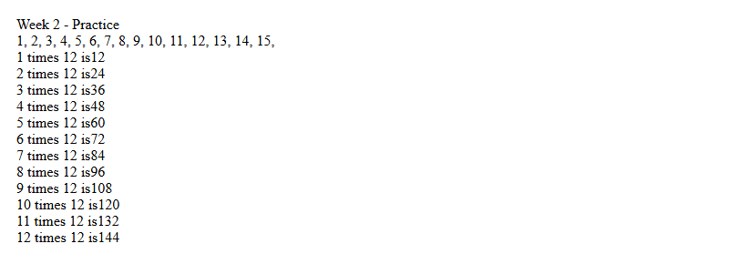
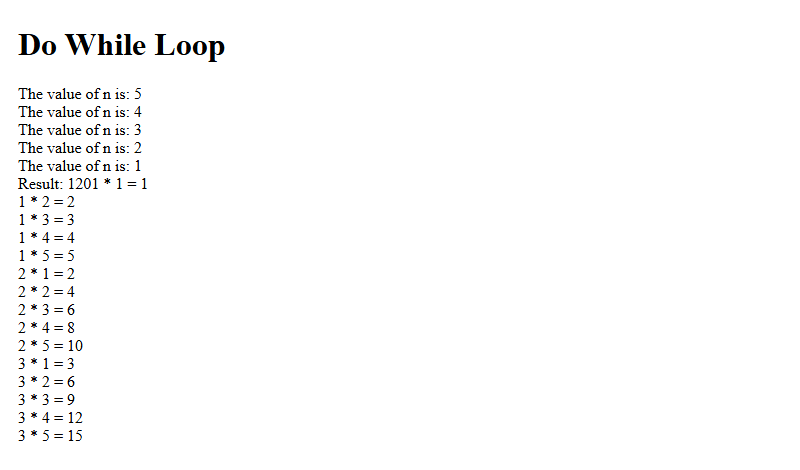
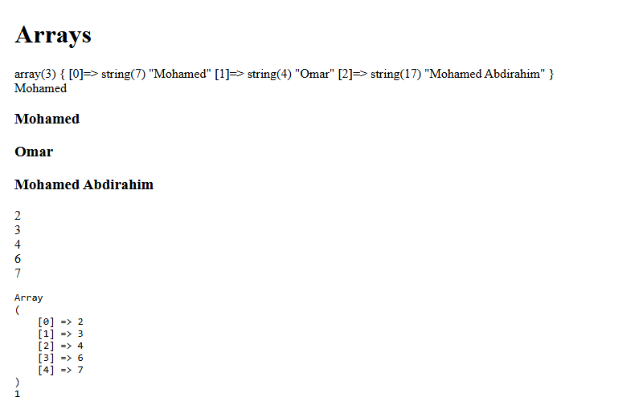
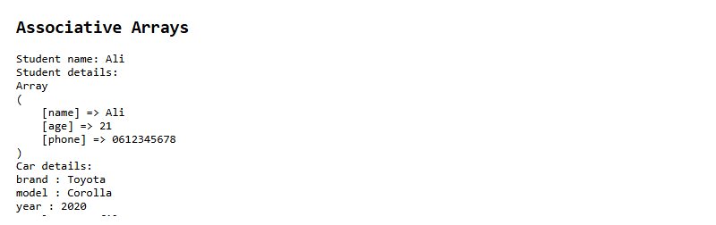
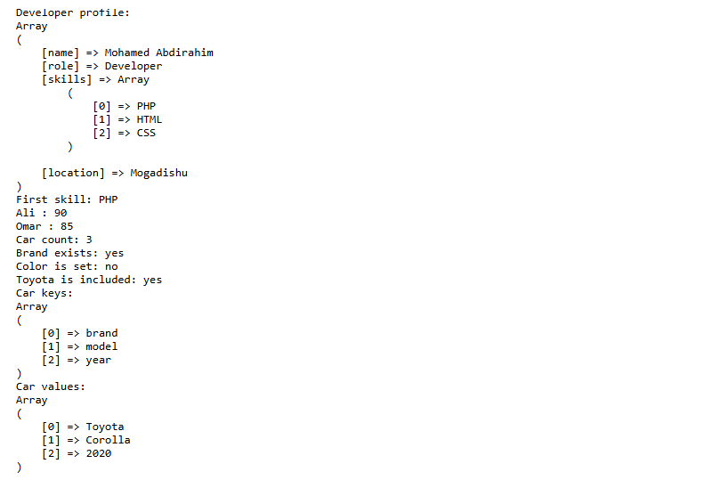

// Week 2: Loops and arrays

My Week 2 practice for Web Application Development (PHP & MySQL) covers loops. Arrays. All examples are in `index.php`. The screenshots below show what each part prints.

// 1. While loop and multiplication

A while loop counts from 1 to 15. A second while loop prints the 12 times table.
php

$i = 1;

while ($i <= 15) {

echo "$i ";

$i++;

}

PHP_While_Loop_Practice.png

// 2. Do-while and nested loops

A do-while loop calculates the factorial of 5. After that two nested for loops print products from 1 × 1 to 3 × 5.
php

$result = 1;

$n = 5;

do {

$result *= $n;

$n--;

} while ($n > 0);

PHP_Do_While_Nested_Loops.png

// 3. Numeric arrays

Build arrays. Read one element. Loop over values with foreach. Dump the array with `print_r`.
php

$numbers = array(2 3 4 6 7);

foreach ($numbers as $number) {

echo "$number\n";

}

print_r($numbers);

PHP_Numeric_Arrays.png

// 4. Associative arrays

A student record receives a phone number. The age is updated. The city is removed with `unset`. The car array is printed as key/value pairs.
php

$student = ["name" => "Ali" "age" => 20 "city" => "Mogadishu"];

$student["phone"] = "0612345678";

$student["age"] = 21;

unset($student["city"]);

print_r($student);

PHP_Associative_Arrays.png

// 5. Nested. Array functions

A developer profile keeps skills in a nested array. A list of students stores each name with a grade. The final part tries `count` `array_keys` and `array_values`, on the car array.
php

$developer = [

"name" => "Mohamed Abdirahim"

"role" => "Developer"

"skills" => ["PHP" "HTML" "CSS"]

];

echo $developer["skills"][0];

print_r(array_keys($car));

PHP_Nested_Arrays_Functions.png
